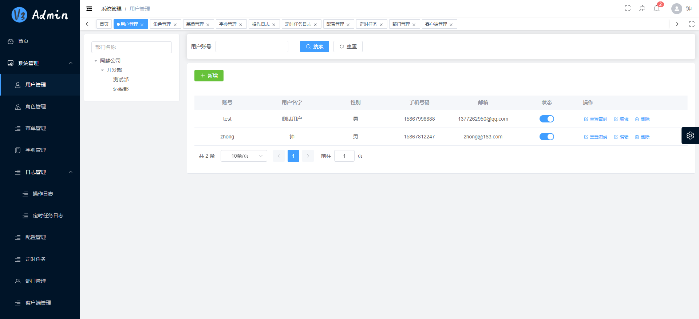
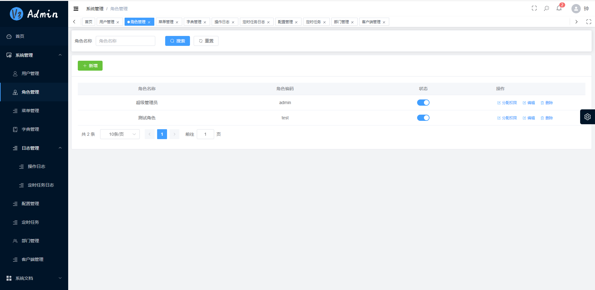
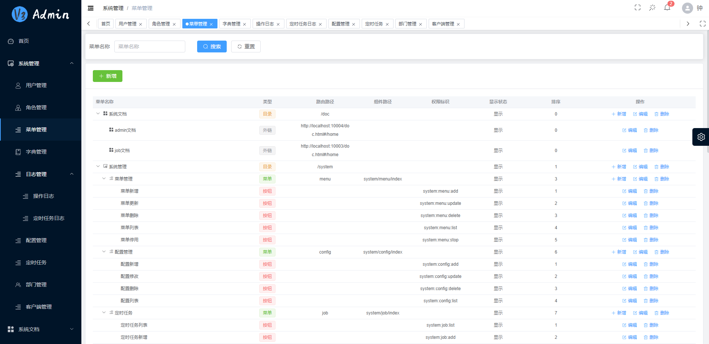
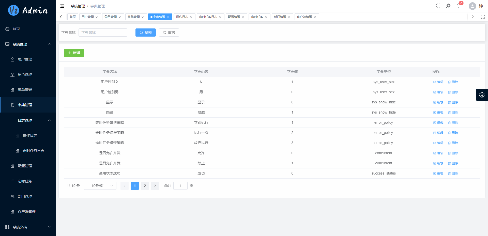
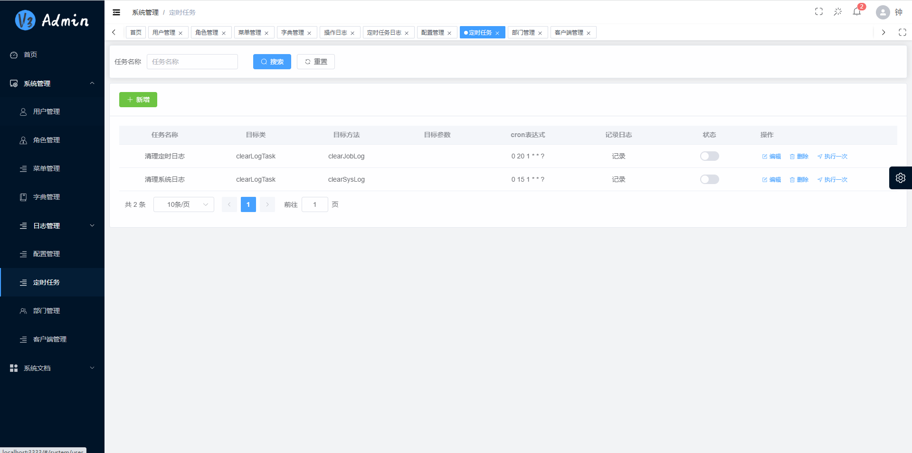
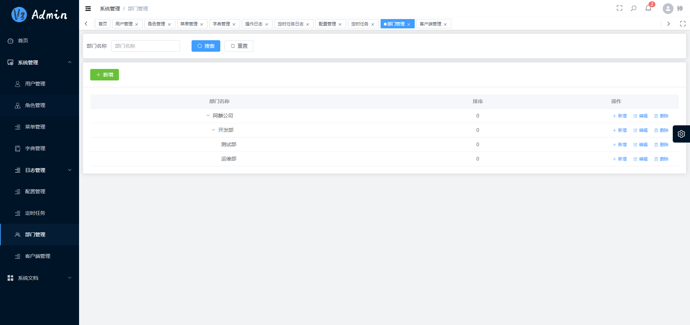
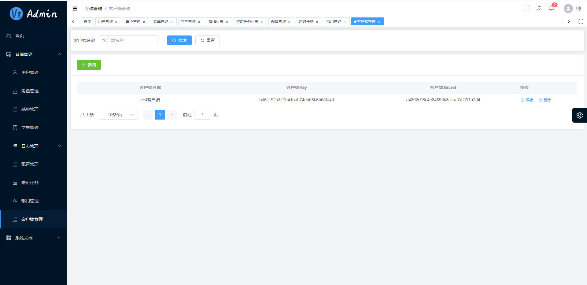

# v3-admin-aqi 后台管理系统

## 项目截图
















## 简介

* 采用前后端分离的模式。
* 后端采用Spring Boot、Spring Cloud & Alibaba。
* 注册中心、配置中心选型Nacos。
* 数据库选型PostgreSQL。
* 其他第三方还有redis。
* 后端很大一部分参考了ruoyi: http://www.ruoyi.vip
* 前端在v3-admin-vite基础上修改：https://gitee.com/un-pany/v3-admin-vite

## 模块总览

- aqi—admin 权限管理服务
- aqi—job 定时任务服务
- aqi-api 内部服务间调用api
- aqi-gateway 微服务网关
- aqi-provider 提供外部接口服务
- aqi-common 基础common模块
    - aqi—common-core 公共基础模块
    - aqi—common-doc 公共文档模块
    - aqi—common-log 公共日志记录模块
    - aqi—common-mybatis 公共mybatis模块
    - aqi—common-redis 公共redis操作模块
    - aqi—common-secure 公共安全模块


## 模块详解

### aqi-admin

aqi-admin是后台权限控制的主要模块，系统管理的相关接口与处理逻辑都放在这里

### aqi-job

aqi-job 是单独抽离出来的定时任务服务，所有的定时任务都在该服务的task文件夹下，具体的定时任务逻辑分布在其他微服务中，通过微服务的内部服务调用实现。

### aqi-api

aqi-api 为微服务的内部服务接口，具体实现分布在各个微服务中的provider文件夹下。

### aqi-provider

aqi-provider 为第三方提供接口的服务。所有的提供给外部的接口都在这个服务中，具体的接口的逻辑分布在其他微服务中，通过微服务的内部服务调用实现。

### aqi-common-core

common-core 模块主要提供了基础的一些工具类、常量类、公共异常以及http响应封装

### aqi-common-doc

common-doc 模块提供knife4 后端接口文档配置，如果项目需要knife4接口文档方便调试，可以引入该模块，需配合配置一起使用

```
knife4:
  title: aqi FRAME
  description: aqi FRAME
  version: 1.0
```

### aqi-common-log

common-log 为操作日志记录模块，如需要记录每次接口调用的信息，可以引用该模块。配合注解@SysLog和数据库表使用。

@SysLog注解在controller层对应的接口上即可，每次调用该接口则会记录相关信息。建议只记录增删改即可。

```
    @RequiresPermissions("system:config:add")
    @ApiOperationSupport(order = 3)
    @ApiOperation(value = "新增配置")
    @PostMapping("/createConfig")
    @SysLog
    public R createConfig(@RequestBody SysConfigDTO sysConfigDTO) {
        sysConfigService.createConfig(sysConfigDTO);
        return R.ok();
    }

```

### aqi-common-mybatis

mybatis操作加强，当数据库表的create_by，create_time,update_by,update_time这4个字段自动填充（新增和更新时）

注意 create_by，create_time,update_by,update_time字段名字固定。

### aqi-common-redis

redis操作封装，配合redis配置项和redis一起使用

### aqi-common-secure

common-secure 为公共的权限控制模块。

## 权限认证

权限认证主要的模块是 common-secure

每一次请求，common-secure公共安全模块会验证token的有效期和有效性，验证通过token中的用户信息解析存入SecurityContextHolder。

每一次调用 如果后端接口上有权限验证的注解（@RequiresPermissions 和 @RequiresRoles）则会验证用户是否有对应的权限，否则会返回权限不足的报错。

为什么在前端已经有动态路由的情况下，后台也要做权限验证：因为前端无法选择调用的情况下，不加后端控制，还是可以通过postman等工具直接调用后端，绕过权限控制。    

## nacos 配置文件

### aqi-admin服务

```yml
server:
    port: 10004
spring:
    datasource:
        driver-class-name: org.postgresql.Driver
        url: jdbc:postgresql://你的ip:5432/v3-admin
        username: 账号
        password: 密码
    redis:
        host: 你的ip
        port: 6379
        database: 4
        ssl: false
        timeout: 1000
        jedis:
            pool:
                max-active: 100
                max-wait: -1
                max-idle: 10
                min-idle: 0            
mybatis:
    mapper-locations: classpath:mapper/*.xml
mybatis-plus:
    mapperPackage: com.aqi.**.mapper
aqi:
    secure:
        skipUrl:
            - /user/login
            - /user/captcha
            - /client/login
            - /doc.html
            - /swagger-ui.html
            - /webjars/**
            - /swagger-resources/**
            - /v2/**
knife4:
    title: AQI FRAME
    description: AQI FRAME
    version: 1.0
dubbo:
    protocol:
        port: -1
    registry:
        address: nacos://你的ip:8848
    consumer:
        check: false
```

### aqi-job服务

```yml
server:
    port: 10003
spring:
    datasource:
        driver-class-name: org.postgresql.Driver
        url: jdbc:postgresql://你的ip:5432/v3-admin
        username: 账号
        password: 密码
    redis:
        host: 你的ip
        port: 6379
        database: 4
        ssl: false
        timeout: 1000
        jedis:
            pool:
                max-active: 100
                max-wait: -1
                max-idle: 10
                min-idle: 0                
mybatis:
    mapper-locations: classpath:mapper/*.xml
mybatis-plus:
    mapperPackage: com.aqi.**.mapper
aqi:
    secure:
        skipUrl:
            - /doc.html
            - /swagger-ui.html
            - /webjars/**
            - /swagger-resources/**
            - /v2/**        
knife4:
    title: AQI FRAME
    description: AQI FRAME
    version: 1.0
dubbo:
    protocol:
        port: -1
    registry:
        address: nacos://你的ip:8848
    consumer:
        check: false
```

### aqi-gateway服务

```yml
server:
    port: 10002     
spring:
    cloud:
        gateway:
            discovery:
                locator:
                    enabled: true
                    lowerCaseServiceId: true
```

### aqi-provider服务

```yml
server:
    port: 10006
spring:
    redis:
        host: 你的ip
        port: 6379
        database: 4
        ssl: false
        timeout: 1000
        jedis:
            pool:
                max-active: 100
                max-wait: -1
                max-idle: 10
                min-idle: 0
knife4:
    title: AQI FRAME
    description: AQI FRAME
    version: 1.0
dubbo:
    protocol:
        port: -1
    registry:
        address: nacos://你的ip:8848
    consumer:
        check: false
```

## 快速启动项目

### 前端启动

前端代码地址：https://gitee.com/java314/v3-admin-vite

```

pnpm install

pnpm dev

```

### 后端启动

后端代码地址：https://gitee.com/java314/v3-admin-aqi

1、nacos配置

部署启动nacos，新建配置文件，配置文件内容参考本文档。


2、数据库配置

根据实际情况新建数据库，nacos中配置数据库地址，数据库用的pgsql。

导入项目提供的sql。

3、redis配置

根据实际情况部署启动redis，nacos中配置redis地址

4、启动项目

启动AQIJobApplication、AQIAdminApplication、AQIFlowApplication、AQIGatewayApplication。启动顺序不分先后。

AQIProviderApplication为对外提供接口的服务，如果对外无需提供接口服务可以不启动。

5、登录系统

系统默认账号密码

zhong/111111

